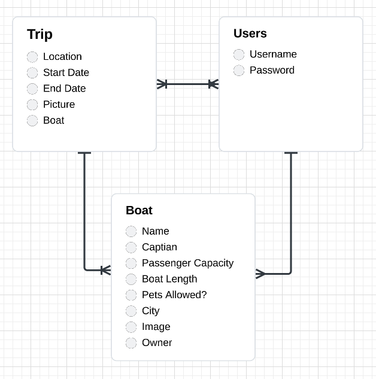

# Project 3 Client

Aaron Humphres, Carter Geile, and Isobel Morales

## Overview 

Software Engineers endure stressfull periods at work and demand unique travel experiences. This app allows them to search and reserve an experience around the globe in a yacht.


Frontend MERN stack app that consumes our trips API. 

https://github.com/isobelmorales/project-3-api

### Technologies Used
- MongoDB
- Mongoose
- Express
- React
- Node
- Bootstrap
- Fly.io

### Link

[TBC]

## Approach

## Installation Instructions

## User Stories 

```
As a user, I want the ability to: 
- sign up for an account.
- sign in to my account.
- sign out of my account.
- change my password.
- create a new trip.
- view all trips. 
- view a trip's location, start date, and end date.
- update a trip I have created.
- delete a trip I have created. 
- post a boat to a trip.
- view a boat's name, captain, passenger capacity, length, city, amd image.
- view whether pets are allowed on the boat.
- view the weather in the boat's city during the trip.
- delete boats I have made.
- view a trip's boats. 
```

## Wireframes


## Entity Relationship Diagrams


## Unsolved Problems / Major Hurdles 
